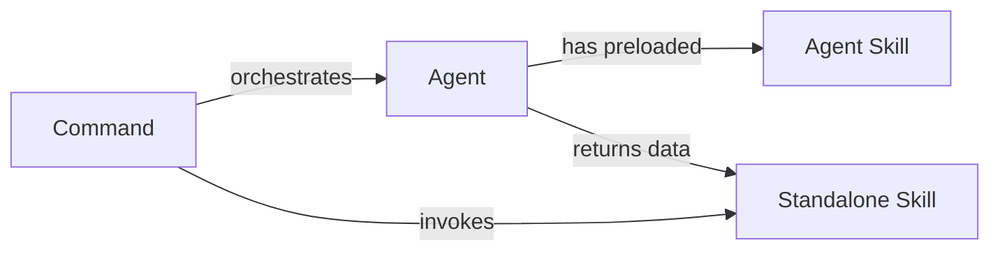

## What Are Skills?

Skills are reusable knowledge bundles that provide:

- **Procedures and workflows** that can be invoked on-demand
- **Domain knowledge** preloaded into agents
- **Slash commands** for quick access
- **Progressive disclosure** to avoid context bloat
- **Dynamic arguments** via string substitutions

<Info>
  Skills live in `.claude/skills/<name>/SKILL.md` and use YAML frontmatter for configuration.
</Info>

## Why Skills Matter

Skills enable knowledge reuse and context optimization:

- **Reduce repetition**: Define procedures once, invoke anywhere
- **Progressive disclosure**: Load knowledge only when needed
- **Agent specialization**: Preload skills into agents for focused expertise
- **Team sharing**: Commit skills to git for team-wide access
- **Composability**: Combine skills with commands and agents

## Two Skill Patterns

Claude Code uses skills in two distinct ways:

<CardGroup cols={2}>
  <Card title="Standalone Skills" icon="play">
    **Invoked on-demand** via `/skill-name` or `Skill(skill="name")` tool.
    
    Used for: Reusable workflows that are called when needed.
    
    Example: `/weather-svg-creator` creates an SVG card
  </Card>
  
  <Card title="Agent Skills" icon="brain">
    **Preloaded at agent startup** via the `skills:` field in agent frontmatter.
    
    Used for: Domain knowledge baked into a specific agent.
    
    Example: `weather-fetcher` preloaded into `weather-agent`
  </Card>
</CardGroup>

### Pattern Comparison

| Aspect | Standalone Skills | Agent Skills |
|--------|------------------|-------------|
| **Loading** | On-demand (lazy) | Preloaded at startup |
| **Invocation** | `/skill-name` or `Skill(skill)` | Automatic — content in context |
| **Use Case** | Workflows invoked by commands/Claude | Background knowledge for agents |
| **Visibility** | Visible in `/` menu (unless `user-invocable: false`) | Hidden from menu |
| **Example** | `weather-svg-creator` | `weather-fetcher` |

<Tip>
  **Key Insight**: Agent skills are **not invoked** — they're **injected**. The full skill content becomes part of the agent's initial context.
</Tip>

## Frontmatter Fields

<ParamField path="name" type="string">
  Display name and `/slash-command` identifier. Defaults to directory name if omitted.
</ParamField>

<ParamField path="description" type="string" required>
  What the skill does. Shown in autocomplete and used by Claude for auto-discovery.
</ParamField>

<ParamField path="argument-hint" type="string">
  Hint shown during autocomplete.
  
  Examples: `[issue-number]`, `[filename]`
</ParamField>

<ParamField path="disable-model-invocation" type="boolean" default="false">
  Set `true` to prevent Claude from automatically invoking this skill.
</ParamField>

<ParamField path="user-invocable" type="boolean" default="true">
  Set `false` to hide from the `/` menu. Skill becomes background knowledge only, intended for agent preloading.
</ParamField>

<ParamField path="allowed-tools" type="string">
  Tools allowed without permission prompts when this skill is active.
  
  Example: `Read, Grep, Glob`
</ParamField>

<ParamField path="model" type="string">
  Model to use when this skill runs.
  
  Accepted values: `haiku`, `sonnet`, `opus`
</ParamField>

<ParamField path="context" type="string">
  Set to `fork` to run the skill in an isolated subagent context.
</ParamField>

<ParamField path="agent" type="string" default="general-purpose">
  Subagent type when `context: fork` is set.
</ParamField>

<ParamField path="hooks" type="object">
  Lifecycle hooks scoped to this skill.
</ParamField>

## String Substitutions

Skills support dynamic values:

| Variable | Description | Example |
|----------|-------------|----------|
| `$ARGUMENTS` | All arguments passed to the skill | `/fix-issue urgent` → `"urgent"` |
| `$ARGUMENTS[N]` | Specific argument by index | `$0`, `$1`, `$2` |
| `$N` | Shorthand for `$ARGUMENTS[N]` | Same as above |
| `${CLAUDE_SESSION_ID}` | Current session identifier | Unique session ID |
| `` !`command` `` | Shell command output injected | `` !`git status --short` `` |

## Real Examples

<CodeGroup>

```yaml Minimal Skill (Standalone)
---
description: Summarize staged changes into a concise changelog entry
---

Summarize the git diff in context into a one-paragraph changelog entry,
focusing on what changed and why.
```

```yaml Agent Skill (Preloaded)
---
name: weather-fetcher
description: Instructions for fetching current weather temperature data for Dubai
user-invocable: false
---

# Weather Fetcher Skill

This skill provides instructions for fetching current weather data.

## Instructions

1. Use WebFetch to get data from Open-Meteo API:
   - For Celsius: `https://api.open-meteo.com/v1/forecast?latitude=25.2048&longitude=55.2708&current=temperature_2m&temperature_unit=celsius`
   - For Fahrenheit: `https://api.open-meteo.com/v1/forecast?latitude=25.2048&longitude=55.2708&current=temperature_2m&temperature_unit=fahrenheit`

2. Extract temperature from `current.temperature_2m`

3. Return the value and unit clearly.
```

```yaml Full-Featured Skill
---
name: code-review
description: Review code for quality, security, and performance issues
argument-hint: [file-path]
allowed-tools: Read, Grep, Glob
model: sonnet
context: fork
agent: general-purpose
hooks:
  Stop:
    - hooks:
        - type: command
          command: "./scripts/log-review-complete.sh"
---

Review the code at $0.

## Checklist
- [ ] Security: injection, XSS, hardcoded secrets
- [ ] Performance: N+1 queries, unnecessary loops
- [ ] Quality: naming, complexity, test coverage
- [ ] Error handling: edge cases, failure modes
```

</CodeGroup>

## How to Use Skills

<Tabs>
  <Tab title="Standalone Skills">
    <Steps>
      <Step title="Create a skill directory">
        ```bash
        mkdir -p .claude/skills/my-skill
        touch .claude/skills/my-skill/SKILL.md
        ```
      </Step>
      
      <Step title="Define the skill">
        ```yaml
        ---
        description: What this skill does
        ---
        
        Instructions for Claude...
        ```
      </Step>
      
      <Step title="Invoke the skill">
        Type `/my-skill` in Claude Code or use from a command:
        
        ```
        Use the Skill tool:
        Skill(skill="my-skill")
        ```
      </Step>
    </Steps>
  </Tab>
  
  <Tab title="Agent Skills (Preloaded)">
    <Steps>
      <Step title="Create the skill">
        ```yaml
        # .claude/skills/my-knowledge/SKILL.md
        ---
        name: my-knowledge
        description: Domain knowledge for X
        user-invocable: false
        ---
        
        # Domain Knowledge
        
        Key concepts:
        1. ...
        2. ...
        ```
      </Step>
      
      <Step title="Preload into agent">
        ```yaml
        # .claude/agents/my-agent.md
        ---
        name: my-agent
        skills:
          - my-knowledge
        ---
        
        You have preloaded knowledge from my-knowledge skill.
        Follow those instructions.
        ```
      </Step>
      
      <Step title="Invoke the agent">
        ```
        Task(subagent_type="my-agent", ...)
        ```
        
        The skill content is automatically in the agent's context.
      </Step>
    </Steps>
  </Tab>
</Tabs>

## Skills in the Reference Repository

From `.claude/skills/` in the best practice repository:

<CardGroup cols={2}>
  <Card title="weather-svg-creator" icon="image">
    **Type**: Standalone skill
    
    Creates SVG weather card and writes output files. Invoked by the `/weather-orchestrator` command after the agent fetches data.
    
    **Pattern**: Skill for independent output creation
  </Card>
  
  <Card title="weather-fetcher" icon="cloud">
    **Type**: Agent skill
    
    Preloaded into `weather-agent`. Provides instructions for fetching temperature from Open-Meteo API.
    
    **Pattern**: Agent skill for domain procedures
  </Card>
  
  <Card title="presentation skills" icon="presentation">
    **Type**: Agent skills
    
    Three skills preloaded into `presentation-curator` agent:
    - `vibe-to-agentic-framework`
    - `presentation-structure`
    - `presentation-styling`
    
    **Pattern**: Multiple skills for complex domain knowledge
  </Card>
</CardGroup>

## Skills Discovery

Claude Code discovers skills in three ways:

### 1. Static Discovery (Fast)

At startup, Claude Code scans:
- `.claude/skills/`
- `~/.claude/skills/`
- Plugin skills directories

Skills found here appear in `/skills` command and autocomplete immediately.

### 2. Dynamic Discovery (On-Demand)

When you read/edit files in a subdirectory, Claude discovers skills in that path:

```
/monorepo/
├── .claude/skills/         # ✓ Loaded at startup
├── frontend/
│   └── .claude/skills/     # Loaded when you work in frontend/
└── backend/
    └── .claude/skills/     # Loaded when you work in backend/
```

<CardGroup cols={1}>
  <Card title="Skills Discovery Report" icon="search" href="/reports/skills-discovery-monorepos">
    Deep dive into how skills are discovered in large monorepo projects
  </Card>
</CardGroup>

## Best Practices

<AccordionGroup>
  <Accordion title="Use user-invocable: false for agent skills">
    Skills meant for agent preloading should be hidden from the slash menu:
    
    ```yaml
    ---
    name: deploy-checklist
    user-invocable: false
    ---
    ```
  </Accordion>
  
  <Accordion title="Keep skills focused">
    Each skill should cover one specific domain or procedure:
    
    **Good**: `deploy-checklist`, `api-auth-flow`, `database-migration`
    
    **Bad**: `everything-about-backend`
  </Accordion>
  
  <Accordion title="Document parameters clearly">
    When skills take arguments, document them:
    
    ```yaml
    ---
    argument-hint: [issue-number]
    ---
    
    Fix GitHub issue $0.
    
    ## Usage
    `/fix-issue 123`
    ```
  </Accordion>
  
  <Accordion title="Use subdirectories for organization">
    ```
    .claude/skills/
    ├── deploy/
    │   ├── staging/SKILL.md
    │   └── production/SKILL.md
    ├── testing/
    │   ├── unit/SKILL.md
    │   └── e2e/SKILL.md
    ```
    
    Invoked as: `/deploy:staging`, `/testing:unit`
  </Accordion>
  
  <Accordion title="Combine skills with agents for specialization">
    The presentation-curator agent shows the pattern:
    
    ```yaml
    ---
    name: presentation-curator
    skills:
      - presentation/vibe-to-agentic-framework
      - presentation/presentation-structure
      - presentation/presentation-styling
    ---
    
    You have three preloaded skills with all the presentation knowledge.
    ```
  </Accordion>
</AccordionGroup>

## Scope and Priority

When multiple skills share the same name:

<Steps>
  <Step title="Project (highest)">
    `.claude/skills/` — Project-specific skills, committed to git
  </Step>
  
  <Step title="Personal">
    `~/.claude/skills/` — Your personal skills across all projects
  </Step>
  
  <Step title="Plugin (lowest)">
    `<plugin>/skills/` — Skills from installed plugins
  </Step>
</Steps>

## Orchestration Pattern

Skills fit into the Command → Agent → Skill architecture:



**Example from repository:**

1. **Command**: `/weather-orchestrator` asks user for C/F
2. **Agent**: `weather-agent` fetches temperature using preloaded `weather-fetcher` skill
3. **Skill**: `weather-svg-creator` creates SVG card with data from agent

<CardGroup cols={1}>
  <Card title="Orchestration Workflow" icon="diagram-project" href="/workflows/orchestration-workflow">
    See the complete pattern with diagrams and code
  </Card>
</CardGroup>

## Cross-Links

<CardGroup cols={2}>
  <Card title="Commands" icon="terminal" href="/concepts/commands">
    Invoke skills from commands
  </Card>
  
  <Card title="Subagents" icon="robot" href="/concepts/subagents">
    Preload skills into agents
  </Card>
  
  <Card title="Settings" icon="gear" href="/concepts/settings">
    Configure skill permissions
  </Card>
  
  <Card title="Skills Best Practice" icon="star" href="/best-practices/skills">
    Complete reference and examples
  </Card>
</CardGroup>

## Further Reading

- [Claude Code Skills — Docs](https://code.claude.com/docs/en/skills)
- [Skills Implementation Examples](/examples/skills-implementation)
- [Skills Discovery in Monorepos](/reports/skills-discovery-monorepos)