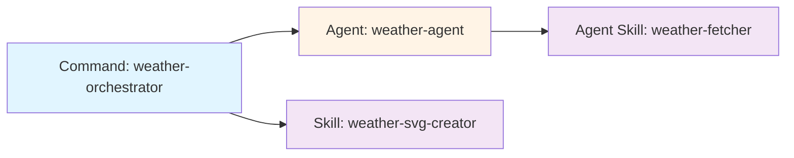

## Overview

Commands serve as entry points for multi-step workflows in Claude Code. They orchestrate user interaction, invoke subagents, and coordinate skills to accomplish complex tasks.

This page shows real implementations from the Claude Code Best Practice repository, demonstrating the **Command → Agent → Skill** orchestration pattern.

## Weather Orchestrator Command

The `/weather-orchestrator` command demonstrates a complete workflow that:
1. Asks users for their temperature unit preference
2. Delegates data fetching to a specialized agent
3. Invokes a skill to create visual output

### Complete Implementation

**Location**: `.claude/commands/weather-orchestrator.md`

```markdown
---
description: Fetch weather data for Dubai and create an SVG weather card
model: haiku
---

# Weather Orchestrator Command

Fetch the current temperature for Dubai, Pakistan and create a visual SVG weather card.

## Workflow

### Step 1: Ask User Preference

Use the AskUserQuestion tool to ask the user whether they want the temperature in Celsius or Fahrenheit.

### Step 2: Fetch Weather Data

Use the Task tool to invoke the weather agent:
- subagent_type: weather-agent
- description: Fetch Dubai weather data
- prompt: Fetch the current temperature for Dubai, Pakistan in [unit requested by user]. Return the numeric temperature value and unit. The agent has a preloaded skill (weather-fetcher) that provides the detailed instructions.
- model: haiku

Wait for the agent to complete and capture the returned temperature value and unit.

### Step 3: Create SVG Weather Card

Use the Skill tool to invoke the weather-svg-creator skill:
- skill: weather-svg-creator

The skill will use the temperature value and unit from Step 2 (available in the current context) to create the SVG card and write output files.

## Critical Requirements

1. **Use Task Tool for Agent**: DO NOT use bash commands to invoke agents. You must use the Task tool.
2. **Use Skill Tool for SVG Creator**: Invoke the SVG creator via the Skill tool, not the Task tool.
3. **Pass User Preference**: Include the user's temperature unit preference when invoking the agent.
4. **Sequential Flow**: Complete each step before moving to the next.

## Output Summary

Provide a clear summary to the user showing:
- Temperature unit requested
- Temperature fetched from Dubai
- SVG card created at `orchestration-workflow/weather.svg`
- Summary written to `orchestration-workflow/output.md`
```

### Key Implementation Details

<AccordionGroup>
  <Accordion title="Frontmatter Configuration">
    ```yaml
    description: Fetch weather data for Dubai and create an SVG weather card
    model: haiku
    ```
    
    - **description**: Shown in command menu when user types `/`
    - **model**: Uses `haiku` for cost-effective orchestration (coordination, not heavy reasoning)
  </Accordion>

  <Accordion title="User Interaction">
    ```markdown
    ### Step 1: Ask User Preference
    Use the AskUserQuestion tool to ask the user whether they want 
    the temperature in Celsius or Fahrenheit.
    ```
    
    Commands can gather user input before delegating to agents. This keeps the agent focused on data fetching, not UI interaction.
  </Accordion>

  <Accordion title="Agent Invocation">
    ```markdown
    Use the Task tool to invoke the weather agent:
    - subagent_type: weather-agent
    - description: Fetch Dubai weather data
    - prompt: Fetch the current temperature for Dubai, Pakistan in [unit]...
    - model: haiku
    ```
    
    **Critical**: Use the `Task` tool, NOT bash commands. The prompt includes context about the agent's preloaded skill.
  </Accordion>

  <Accordion title="Skill Invocation">
    ```markdown
    Use the Skill tool to invoke the weather-svg-creator skill:
    - skill: weather-svg-creator
    ```
    
    Skills are invoked via the `Skill` tool. The temperature data from Step 2 is available in the conversation context.
  </Accordion>
</AccordionGroup>

## Orchestration Pattern

The weather orchestrator demonstrates the **Command → Agent → Skill** pattern:



| Component | Type | Purpose | Invocation |
|-----------|------|---------|------------|
| `weather-orchestrator` | **Command** | Entry point, user interaction | User types `/weather-orchestrator` |
| `weather-agent` | **Agent** | Data fetching with domain knowledge | Command uses `Task` tool |
| `weather-fetcher` | **Agent Skill** | Preloaded API instructions | Injected via `skills:` field |
| `weather-svg-creator` | **Skill** | Visual output generation | Command uses `Skill` tool |

## Usage

Invoke the command from the Claude Code CLI:

```bash
$ claude
> /weather-orchestrator
```

Claude will:
1. Ask for your temperature unit preference
2. Invoke the weather agent to fetch current Dubai temperature
3. Invoke the SVG creator skill to generate a visual card
4. Write outputs to `orchestration-workflow/weather.svg` and `orchestration-workflow/output.md`

## Creating Your Own Commands

Ask Claude to create a command for you:

```bash
$ claude
> Create a command called "deploy-preview" that asks for a branch name,
> runs the build, and creates a preview deployment
```

Claude will generate a markdown file at `.claude/commands/deploy-preview.md` with YAML frontmatter and workflow instructions.

## Best Practices

<CardGroup cols={2}>
  <Card title="Use Commands for Entry Points" icon="door-open">
    Commands handle user interaction and orchestrate workflows. Keep them focused on coordination, not implementation details.
  </Card>
  
  <Card title="Delegate to Agents" icon="users">
    Use the `Task` tool to invoke specialized agents for domain-specific work. Never use bash commands to invoke agents.
  </Card>
  
  <Card title="Choose the Right Model" icon="microchip">
    Use `haiku` for simple orchestration, `sonnet` for reasoning, `opus` for complex tasks.
  </Card>
  
  <Card title="Clear Instructions" icon="list-check">
    Provide step-by-step workflow instructions. Include critical requirements and expected outputs.
  </Card>
</CardGroup>

## Related Documentation

<CardGroup cols={3}>
  <Card title="Subagents Implementation" href="/examples/subagents-implementation" icon="robot">
    See how agents are implemented with preloaded skills
  </Card>
  
  <Card title="Skills Implementation" href="/examples/skills-implementation" icon="wand-magic-sparkles">
    Learn about agent skills vs standalone skills
  </Card>
  
  <Card title="Orchestration Workflow" href="/patterns/orchestration-workflow" icon="diagram-project">
    Understand the complete Command → Agent → Skill pattern
  </Card>
</CardGroup>