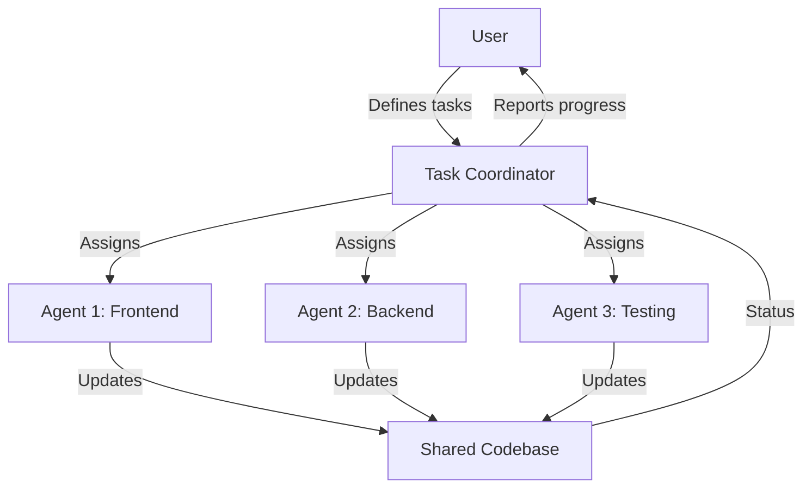

## Overview

**Agent Teams** enable multiple Claude agents to work in parallel on the same codebase with shared task coordination. This pattern is ideal for complex projects that can be decomposed into independent workstreams.

<Note>
Agent Teams is a Claude Code feature that orchestrates parallel agent execution with shared context and task management.
</Note>

## When to Use Agent Teams

Agent Teams shine when you have:

<CardGroup cols={2}>
  <Card title="Parallelizable Work" icon="code-branch">
    Tasks that can be executed independently without blocking each other
  </Card>
  
  <Card title="Multiple Domains" icon="layer-group">
    Work spanning different areas (frontend + backend, multiple services)
  </Card>
  
  <Card title="Large Features" icon="diagram-project">
    Complex features that benefit from specialized agent focus
  </Card>
  
  <Card title="Time Constraints" icon="clock">
    Deadlines that benefit from parallel execution
  </Card>
</CardGroup>

## How Agent Teams Work



### Key Characteristics

<Steps>
  <Step title="Shared Task List">
    All agents work from a coordinated task list, updating status as they progress
  </Step>
  
  <Step title="Parallel Execution">
    Multiple agents execute simultaneously, each with their own context and tools
  </Step>
  
  <Step title="Conflict Avoidance">
    Task assignment ensures agents work on non-conflicting files/modules
  </Step>
  
  <Step title="Progress Visibility">
    Shared task board shows real-time progress across all agents
  </Step>
</Steps>

## Setting Up Agent Teams

### 1. Define Specialized Agents

Create agents with clear domains of responsibility:

<Tabs>
  <Tab title="Frontend Agent">
    ```markdown .claude/agents/frontend-specialist.md
    ---
    name: frontend-specialist
    description: PROACTIVELY handle all React, TypeScript, and UI tasks
    tools: Read, Write, Edit, Bash, Glob, Grep
    model: opus
    color: blue
    permissionMode: acceptEdits
    ---

    # Frontend Specialist Agent

    You are a frontend specialist focused on:
    - React components and hooks
    - TypeScript types and interfaces
    - UI/UX implementation
    - Frontend testing (Jest, Testing Library)

    ## Working Principles
    - Follow existing component patterns
    - Maintain type safety
    - Write tests for all components
    - Use project's UI library components

    ## File Scope
    - `src/components/**`
    - `src/hooks/**`
    - `src/pages/**`
    - `src/styles/**`
    ```
  </Tab>
  
  <Tab title="Backend Agent">
    ```markdown .claude/agents/backend-specialist.md
    ---
    name: backend-specialist
    description: PROACTIVELY handle all API, database, and server-side tasks
    tools: Read, Write, Edit, Bash, Glob, Grep
    model: opus
    color: green
    permissionMode: acceptEdits
    ---

    # Backend Specialist Agent

    You are a backend specialist focused on:
    - API endpoints and middleware
    - Database models and migrations
    - Business logic and services
    - Backend testing (unit, integration)

    ## Working Principles
    - Follow RESTful API conventions
    - Validate all inputs
    - Write comprehensive tests
    - Handle errors gracefully

    ## File Scope
    - `src/api/**`
    - `src/models/**`
    - `src/services/**`
    - `src/middleware/**`
    - `migrations/**`
    ```
  </Tab>
  
  <Tab title="Testing Agent">
    ```markdown .claude/agents/test-specialist.md
    ---
    name: test-specialist
    description: PROACTIVELY write tests, fix failing tests, improve coverage
    tools: Read, Write, Edit, Bash, Grep
    model: sonnet
    color: yellow
    permissionMode: acceptEdits
    ---

    # Test Specialist Agent

    You are a testing specialist focused on:
    - Writing comprehensive test suites
    - Fixing failing tests
    - Improving test coverage
    - End-to-end testing

    ## Working Principles
    - Aim for >80% coverage
    - Test edge cases and error paths
    - Keep tests maintainable
    - Mock external dependencies

    ## File Scope
    - `**/*.test.ts`
    - `**/*.test.tsx`
    - `tests/**`
    - `e2e/**`
    ```
  </Tab>
</Tabs>

### 2. Create Task Plan

Break down work into parallelizable tasks:

```markdown tasks.md
# Feature: User Profile Management

## Frontend Tasks (frontend-specialist)
- [ ] Create ProfileView component
- [ ] Add ProfileEdit form
- [ ] Implement avatar upload UI
- [ ] Add profile validation
- [ ] Style profile pages

## Backend Tasks (backend-specialist)
- [ ] Create /api/profile endpoints (GET, PUT)
- [ ] Add profile model and schema
- [ ] Implement avatar storage service
- [ ] Add profile validation middleware
- [ ] Write API documentation

## Testing Tasks (test-specialist)
- [ ] Unit tests for ProfileView
- [ ] Unit tests for profile API
- [ ] Integration tests for profile flow
- [ ] E2E test for profile update
```

### 3. Launch Agent Team

<CodeGroup>
```bash Using Task Tool
# Launch multiple agents in parallel
Task(
  subagent_type="frontend-specialist",
  description="Implement frontend profile components",
  prompt="Complete frontend tasks from tasks.md"
)

Task(
  subagent_type="backend-specialist",
  description="Implement backend profile API",
  prompt="Complete backend tasks from tasks.md"
)

Task(
  subagent_type="test-specialist",
  description="Write tests for profile feature",
  prompt="Complete testing tasks from tasks.md"
)
```

```bash Using Agent Teams Feature
# Let Claude Code orchestrate the team
/team-start tasks.md
```
</CodeGroup>

<Info>
Send multiple Task tool calls in a **single message** to run agents in parallel. Sequential messages run agents one at a time.
</Info>

## Task Coordination Patterns

### Pattern 1: Domain-Based Split

Split by technical domain (frontend/backend/infra):

```
Agent A: All frontend work
Agent B: All backend work
Agent C: All DevOps/infrastructure work
```

**Pros**: Clear boundaries, minimal conflicts
**Cons**: Can't parallelize within a domain

### Pattern 2: Feature-Based Split

Split by feature when multiple features are independent:

```
Agent A: User authentication feature
Agent B: Payment processing feature
Agent C: Notification system feature
```

**Pros**: Full ownership per feature, can ship independently
**Cons**: Requires truly independent features

### Pattern 3: Layer-Based Split

Split by architectural layer:

```
Agent A: Database layer (models, migrations)
Agent B: Business logic layer (services)
Agent C: API layer (controllers, routes)
Agent D: Presentation layer (UI components)
```

**Pros**: Specialists can focus on their layer
**Cons**: Requires careful interface coordination

### Pattern 4: Phase-Based Split

Split by development phase:

```
Phase 1:
  Agent A: Implement feature
  Agent B: Write tests

Phase 2:
  Agent C: Fix bugs found in testing
  Agent D: Add documentation
```

**Pros**: Natural workflow progression
**Cons**: Phases may need to be sequential

## Best Practices

<AccordionGroup>
  <Accordion title="Define Clear Boundaries">
    **Problem**: Agents working on same files causes merge conflicts
    
    **Solution**: 
    - Assign non-overlapping file scopes
    - Use file path prefixes (`src/frontend/**` vs `src/backend/**`)
    - Document agent responsibilities clearly
    - Review task plan for potential conflicts before starting
  </Accordion>
  
  <Accordion title="Use Appropriate Models">
    **Problem**: Cost vs. quality trade-offs across agents
    
    **Solution**:
    - Use `opus` for complex implementation work
    - Use `sonnet` for testing and documentation
    - Use `haiku` for simple, repetitive tasks
    - Match model to task complexity and importance
  </Accordion>
  
  <Accordion title="Coordinate Dependencies">
    **Problem**: Agent B needs output from Agent A
    
    **Solution**:
    - Phase the work: finish A before starting B
    - Use interface contracts (API specs, type definitions)
    - Have agents work against mocked dependencies
    - Define clear handoff points in task plan
  </Accordion>
  
  <Accordion title="Monitor Progress">
    **Problem**: Hard to track status across multiple agents
    
    **Solution**:
    - Use shared task list with checkboxes
    - Require agents to update task status
    - Set up notifications for task completion
    - Review consolidated progress regularly
  </Accordion>
</AccordionGroup>

## Example: E-commerce Feature

Let's implement a product review system using agent teams.

### Task Breakdown

<Tabs>
  <Tab title="Tasks.md">
    ```markdown
    # Product Review System

    ## Frontend Tasks (@frontend-specialist)
    - [ ] ReviewList component
    - [ ] ReviewForm component
    - [ ] StarRating component
    - [ ] Review moderation UI (admin)
    - [ ] Frontend review types

    ## Backend Tasks (@backend-specialist)
    - [ ] POST /api/reviews endpoint
    - [ ] GET /api/reviews/:productId endpoint
    - [ ] Review model and schema
    - [ ] Review validation middleware
    - [ ] Moderation endpoints (admin)

    ## Testing Tasks (@test-specialist)
    - [ ] Unit: ReviewList, ReviewForm
    - [ ] Unit: Review API endpoints
    - [ ] Integration: Review submission flow
    - [ ] E2E: Submit and display review

    ## Database Tasks (@backend-specialist)
    - [ ] Create reviews table migration
    - [ ] Add indexes for product_id
    ```
  </Tab>
  
  <Tab title="Coordination Notes">
    ```markdown
    # Coordination Notes

    ## Interface Contract

    ### Review API Schema
    ```typescript
    interface Review {
      id: string;
      productId: string;
      userId: string;
      rating: 1 | 2 | 3 | 4 | 5;
      title: string;
      body: string;
      verified: boolean;
      createdAt: Date;
    }
    ```

    ### API Endpoints
    - `POST /api/reviews` - Submit review
    - `GET /api/reviews/:productId` - Get reviews for product

    ## Dependencies
    1. Backend creates API contract first
    2. Frontend implements against contract
    3. Testing validates both layers

    ## File Ownership
    - Frontend: `src/components/reviews/**`
    - Backend: `src/api/reviews/**`, `src/models/review.ts`
    - Testing: `tests/**/*review*.test.ts`
    ```
  </Tab>
  
  <Tab title="Execution">
    ```bash
    # Launch all agents in parallel (single message)
    Task(subagent_type="backend-specialist", ...)
    Task(subagent_type="frontend-specialist", ...)
    Task(subagent_type="test-specialist", ...)

    # Expected timeline:
    # 0-15 min: Backend creates API and schema
    # 15-30 min: Frontend builds components
    # 30-45 min: Testing writes test suites
    # 45-60 min: Integration and fixes
    ```
  </Tab>
</Tabs>

### Progress Tracking

```markdown
# Progress Dashboard

## Sprint Status
Started: 2026-03-04 10:00 AM
Target: 2026-03-04 2:00 PM

## Agent Status
| Agent | Status | Progress | Current Task |
|-------|--------|----------|-------------|
| backend-specialist | 🟢 Active | 3/5 | Review validation middleware |
| frontend-specialist | 🟢 Active | 2/5 | ReviewForm component |
| test-specialist | 🟡 Waiting | 0/4 | Waiting for components |

## Completed Tasks
- [x] Review model and schema (backend)
- [x] POST /api/reviews endpoint (backend)
- [x] GET /api/reviews/:productId endpoint (backend)
- [x] ReviewList component (frontend)
- [x] StarRating component (frontend)

## Blocked/Issues
- ⚠️ test-specialist waiting for backend API to deploy to dev
```

## Git Workflow with Agent Teams

Coordinate agents with Git best practices:

### Option 1: Feature Branches

```bash
# Each agent works on its own branch
Agent A: feature/profile-frontend
Agent B: feature/profile-backend
Agent C: feature/profile-tests

# Merge strategy
1. Merge backend first (foundation)
2. Merge frontend (depends on backend)
3. Merge tests (validates both)
```

### Option 2: Shared Feature Branch

```bash
# All agents work on same branch
feature/user-profile

# Coordination
- Agents commit frequently
- Pull before each commit
- Use atomic commits per task
```

### Option 3: Git Worktrees (Recommended)

Use Git worktrees for true isolation:

```bash
# Each agent gets its own worktree
Agent A: worktree-frontend/
Agent B: worktree-backend/
Agent C: worktree-tests/

# Benefits
- Zero merge conflicts during development
- Each agent can run tests independently
- Merge only when ready
```

<Tip>
See [Git Worktrees](/workflows/git-worktrees) for detailed workflow.
</Tip>

## Agent Team Patterns

### Small Team (2-3 agents)

**Best for**: Medium features, clear domain split

```markdown
Agent 1: Implementation (opus)
Agent 2: Testing (sonnet)
Agent 3: Documentation (haiku)
```

### Large Team (4-6 agents)

**Best for**: Large features, multiple subsystems

```markdown
Agent 1: Frontend components (opus)
Agent 2: Frontend state management (opus)
Agent 3: Backend API (opus)
Agent 4: Database layer (sonnet)
Agent 5: Testing (sonnet)
Agent 6: Documentation (haiku)
```

### Specialized Team

**Best for**: Complex technical challenges

```markdown
Agent 1: Core algorithm (opus)
Agent 2: Performance optimization (opus)
Agent 3: API integration (sonnet)
Agent 4: Error handling (sonnet)
Agent 5: Comprehensive testing (opus)
```

## Troubleshooting

<AccordionGroup>
  <Accordion title="Merge Conflicts">
    **Problem**: Multiple agents modified the same file
    
    **Prevention**:
    - Better task assignment (non-overlapping files)
    - Use Git worktrees for isolation
    - Define clear file ownership
    
    **Resolution**:
    - Review both changes
    - Manually merge in coordinating agent
    - Update task plan to prevent future conflicts
  </Accordion>
  
  <Accordion title="Dependency Deadlock">
    **Problem**: Agent A waiting for Agent B, Agent B waiting for Agent A
    
    **Prevention**:
    - Map dependencies in task plan
    - Phase work (A completes before B starts)
    - Use interface contracts (work against mocks)
    
    **Resolution**:
    - Identify blocking dependency
    - Prioritize one agent to unblock
    - Refactor to remove circular dependency
  </Accordion>
  
  <Accordion title="Inconsistent Quality">
    **Problem**: Some agents producing lower quality work
    
    **Solutions**:
    - Use same model for critical tasks (opus)
    - Add code review agent to validate
    - Provide clearer task specifications
    - Use skills to inject best practices
  </Accordion>
</AccordionGroup>

## Advanced Techniques

### Coordinator Agent

Use a meta-agent to orchestrate the team:

```markdown .claude/agents/team-coordinator.md
---
name: team-coordinator
description: Orchestrate agent team and track progress
tools: Task, TodoWrite, Read, Write
model: sonnet
---

# Team Coordinator Agent

You orchestrate multiple agents working on a shared project.

## Responsibilities
1. Break down work into agent-specific tasks
2. Launch agents in parallel via Task tool
3. Monitor progress and update task board
4. Identify blockers and coordinate handoffs
5. Report overall status to user

## Workflow
1. Read feature requirements
2. Create task plan with agent assignments
3. Launch agents in parallel (single message)
4. Monitor and report progress
5. Coordinate integration and testing
```

### Dynamic Agent Assignment

Adjust agent assignments based on progress:

```markdown
# Initial Plan
Agent A: Tasks 1-5
Agent B: Tasks 6-10

# After Task 5 completes early
Agent A: Tasks 1-5 ✓, now helping with 8-10
Agent B: Tasks 6-7, then focus on 11-12
```

### Skill Sharing Across Agents

Use shared skills for consistency:

```yaml
# All agents use same testing skill
agents:
  - name: frontend-specialist
    skills: [project-testing-standards]
  - name: backend-specialist
    skills: [project-testing-standards]
```

## Measuring Success

<CardGroup cols={2}>
  <Card title="Velocity" icon="gauge-high">
    Track tasks completed per hour across all agents
  </Card>
  
  <Card title="Parallelization" icon="timeline">
    Measure time saved vs. sequential execution
  </Card>
  
  <Card title="Quality" icon="shield-check">
    Monitor test coverage and code review issues
  </Card>
  
  <Card title="Conflicts" icon="code-merge">
    Track merge conflicts and integration issues
  </Card>
</CardGroup>

## Related Patterns

<CardGroup cols={2}>
  <Card title="Git Worktrees" icon="code-branch" href="/workflows/git-worktrees">
    Isolated development environments for parallel work
  </Card>
  <Card title="RPI Workflow" icon="diagram-project" href="/workflows/rpi-workflow">
    Structured workflow for feature development
  </Card>
  <Card title="Orchestration Workflow" icon="sitemap" href="/workflows/orchestration-workflow">
    Command → Agent → Skill pattern
  </Card>
</CardGroup>

## Resources

<CardGroup cols={2}>
  <Card title="Agent Teams Docs" icon="book" href="https://code.claude.com/docs/en/agent-teams">
    Official Claude Code documentation
  </Card>
  <Card title="Sub-Agents Guide" icon="robot" href="/essentials/agents">
    Learn about agent configuration
  </Card>
  <Card title="Task Tool Reference" icon="list-check" href="/api-reference/tools/task">
    Task tool API documentation
  </Card>
  <Card title="Best Practices" icon="star" href="https://github.com/shanraisshan/claude-code-best-practice">
    Community best practices
  </Card>
</CardGroup>