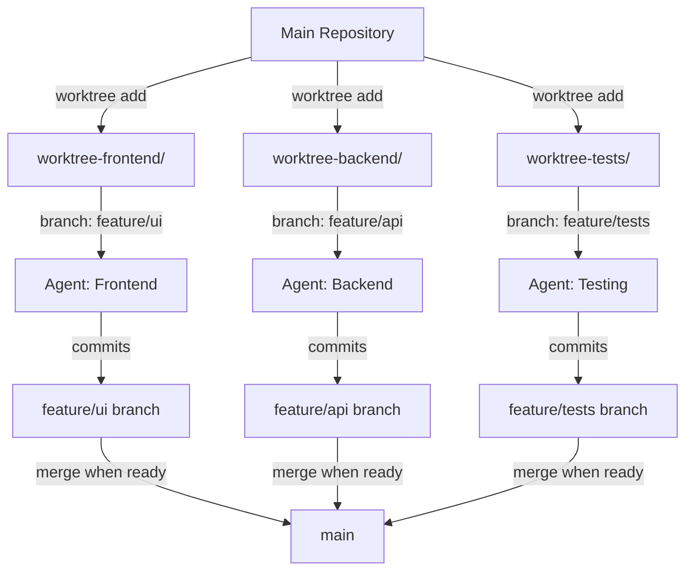

## Overview

**Git Worktrees** allow multiple agents (or developers) to work on different branches simultaneously in separate directories, all from the same repository. This eliminates merge conflicts during active development and enables true parallel work.

<Note>
Git worktrees are a built-in Git feature that Claude Code can leverage for parallel agent execution with perfect isolation.
</Note>

## The Problem with Shared Branches

When multiple agents work on the same branch:

<CardGroup cols={2}>
  <Card title="❌ Traditional Approach" icon="triangle-exclamation" color="#ef4444">
    **Single Working Directory**
    
    - Agent A modifies `file.ts`
    - Agent B also modifies `file.ts`
    - Merge conflict on every commit
    - Constant pull/push coordination needed
    - Build breaks if agents aren't synced
  </Card>
  
  <Card title="✅ Git Worktrees" icon="circle-check" color="#22c55e">
    **Isolated Directories**
    
    - Agent A: `worktree-a/file.ts`
    - Agent B: `worktree-b/file.ts`
    - Zero conflicts during development
    - Each can run tests independently
    - Merge only when ready
  </Card>
</CardGroup>

## How Git Worktrees Work



### Key Concepts

<AccordionGroup>
  <Accordion title="Main Repository">
    Your original `.git` directory and working tree. This is the "main" worktree.
    
    ```bash
    /project/
    ├── .git/
    ├── src/
    └── package.json
    ```
  </Accordion>
  
  <Accordion title="Additional Worktrees">
    Separate directories linked to the same `.git`, each on a different branch.
    
    ```bash
    /project/
    ├── .git/
    ├── src/                    # main worktree (main branch)
    ├── worktree-frontend/      # feature/ui branch
    ├── worktree-backend/       # feature/api branch
    └── worktree-tests/         # feature/tests branch
    ```
  </Accordion>
  
  <Accordion title="Shared Git Database">
    All worktrees share the same commits, branches, and history. Changes in one worktree don't affect others until merged.
    
    ```bash
    # In worktree-frontend/
    git commit -m "Add UI component"
    
    # In worktree-backend/
    # ← Doesn't see the UI commit yet
    # ← Can work independently
    ```
  </Accordion>
</AccordionGroup>

## Basic Usage

### Creating Worktrees

<CodeGroup>
```bash Create New Worktree
# Create worktree for new branch
git worktree add -b feature/ui worktree-frontend

# Result:
# - Creates directory: worktree-frontend/
# - Creates branch: feature/ui
# - Checks out feature/ui in worktree-frontend/
```

```bash Create from Existing Branch
# Create worktree from existing branch
git worktree add worktree-backend feature/api

# Result:
# - Creates directory: worktree-backend/
# - Checks out existing branch: feature/api
```

```bash Multiple Worktrees
# Set up team of agents
git worktree add -b feature/ui worktree-frontend
git worktree add -b feature/api worktree-backend
git worktree add -b feature/tests worktree-tests

# Now you have:
# main/                  → main branch
# worktree-frontend/    → feature/ui branch
# worktree-backend/     → feature/api branch
# worktree-tests/       → feature/tests branch
```
</CodeGroup>

### Working in Worktrees

<Tabs>
  <Tab title="Agent A (Frontend)">
    ```bash
    cd worktree-frontend/
    
    # Work on UI
    # Edit src/components/Profile.tsx
    
    git add src/components/Profile.tsx
    git commit -m "Add profile component"
    
    # Run tests in isolation
    npm test
    
    # Push when ready
    git push -u origin feature/ui
    ```
  </Tab>
  
  <Tab title="Agent B (Backend)">
    ```bash
    cd worktree-backend/
    
    # Work on API
    # Edit src/api/profile.ts
    
    git add src/api/profile.ts
    git commit -m "Add profile API"
    
    # Run tests in isolation
    npm test
    
    # Push when ready
    git push -u origin feature/api
    ```
  </Tab>
  
  <Tab title="Agent C (Tests)">
    ```bash
    cd worktree-tests/
    
    # Work on tests
    # Edit tests/profile.test.ts
    
    git add tests/profile.test.ts
    git commit -m "Add profile tests"
    
    # Run full test suite
    npm test
    
    # Push when ready
    git push -u origin feature/tests
    ```
  </Tab>
</Tabs>

### Managing Worktrees

<CodeGroup>
```bash List Worktrees
git worktree list

# Output:
# /project                     abc1234 [main]
# /project/worktree-frontend   def5678 [feature/ui]
# /project/worktree-backend    ghi9012 [feature/api]
```

```bash Remove Worktree
# When done with a worktree
git worktree remove worktree-frontend

# Or if directory already deleted
git worktree prune
```

```bash Move Worktree
# Rename/move worktree directory
mv worktree-frontend frontend-work

# Update Git's record
git worktree repair
```
</CodeGroup>

## Claude Code Integration

Use worktrees with Claude Code agents for parallel development:

### Pattern 1: Agent Isolation Frontmatter

Use the `isolation: worktree` frontmatter to automatically create worktrees:

```markdown .claude/agents/frontend-specialist.md
---
name: frontend-specialist
description: PROACTIVELY handle React and TypeScript work
model: opus
isolation: worktree
color: blue
---

# Frontend Specialist

You work on UI components in complete isolation via git worktree.

## Your Workspace
You're in a dedicated worktree directory. You can:
- Commit without conflicts
- Run tests independently
- Push your branch when ready

## Workflow
1. Make changes to components
2. Commit frequently
3. Run tests: `npm test`
4. Push when phase complete
```

<Info>
When you invoke this agent via Task tool, Claude Code automatically creates a worktree on a new branch.
</Info>

### Pattern 2: Manual Worktree Setup

Create worktrees before launching agents:

<Steps>
  <Step title="Create Worktrees">
    ```bash
    # Set up isolated environments
    git worktree add -b feature/profile-ui worktree-ui
    git worktree add -b feature/profile-api worktree-api
    git worktree add -b feature/profile-tests worktree-tests
    ```
  </Step>
  
  <Step title="Launch Agents in Worktrees">
    ```bash
    # In main directory, launch agents
    # Each agent's workdir points to its worktree
    
    Task(
      subagent_type="frontend-specialist",
      description="Implement UI in worktree-ui",
      prompt="Work in worktree-ui/ directory. Implement profile UI."
    )
    
    Task(
      subagent_type="backend-specialist",
      description="Implement API in worktree-api",
      prompt="Work in worktree-api/ directory. Implement profile API."
    )
    ```
  </Step>
  
  <Step title="Merge When Ready">
    ```bash
    # After agents complete and tests pass
    git checkout main
    git merge feature/profile-api
    git merge feature/profile-ui
    git merge feature/profile-tests
    ```
  </Step>
</Steps>

## Real-World Example: E-commerce Feature

Implementing a product review system with 3 parallel agents:

### Setup

```bash
# Create worktrees for each domain
git worktree add -b reviews/frontend worktree-reviews-ui
git worktree add -b reviews/backend worktree-reviews-api
git worktree add -b reviews/tests worktree-reviews-tests

# Directory structure:
# project/
# ├── .git/
# ├── src/                          # main branch
# ├── worktree-reviews-ui/          # reviews/frontend branch
# ├── worktree-reviews-api/         # reviews/backend branch
# └── worktree-reviews-tests/       # reviews/tests branch
```

### Agent Execution

<Tabs>
  <Tab title="Frontend Agent">
    ```markdown Agent Prompt
    You are working in worktree-reviews-ui/ directory.
    
    Tasks:
    1. Create ReviewList component
    2. Create ReviewForm component
    3. Add StarRating component
    4. Implement review submission
    
    Your workspace:
    - Branch: reviews/frontend
    - Directory: worktree-reviews-ui/
    - Focus: src/components/reviews/
    
    Workflow:
    1. Implement each component
    2. Commit after each task
    3. Run `npm test` to verify
    4. Push branch when complete
    ```
  </Tab>
  
  <Tab title="Backend Agent">
    ```markdown Agent Prompt
    You are working in worktree-reviews-api/ directory.
    
    Tasks:
    1. Create Review model
    2. Add POST /api/reviews endpoint
    3. Add GET /api/reviews/:productId endpoint
    4. Implement review validation
    
    Your workspace:
    - Branch: reviews/backend
    - Directory: worktree-reviews-api/
    - Focus: src/api/reviews/
    
    Workflow:
    1. Implement each endpoint
    2. Commit after each task
    3. Run tests: `npm test`
    4. Push branch when complete
    ```
  </Tab>
  
  <Tab title="Testing Agent">
    ```markdown Agent Prompt
    You are working in worktree-reviews-tests/ directory.
    
    Tasks:
    1. Unit tests for ReviewList, ReviewForm
    2. Unit tests for review API
    3. Integration tests for review flow
    4. E2E test for submit and display
    
    Your workspace:
    - Branch: reviews/tests
    - Directory: worktree-reviews-tests/
    - Focus: tests/reviews/
    
    Note: You're testing against mocked API contracts.
    Actual integration happens after merge.
    ```
  </Tab>
</Tabs>

### Merging Strategy

```bash
# After all agents complete

# 1. Merge backend first (foundation)
git checkout main
git merge reviews/backend
git push

# 2. Merge frontend (depends on backend types)
git merge reviews/frontend
git push

# 3. Merge tests (validates both)
git merge reviews/tests
git push

# 4. Clean up worktrees
git worktree remove worktree-reviews-ui
git worktree remove worktree-reviews-api
git worktree remove worktree-reviews-tests

# 5. Delete remote branches (optional)
git push origin --delete reviews/frontend
git push origin --delete reviews/backend
git push origin --delete reviews/tests
```

## Advanced Patterns

### Shared Dependencies

**Problem**: `node_modules` duplicated in each worktree

**Solution**: Symlink shared directories

```bash
# After creating worktree
cd worktree-frontend/
rm -rf node_modules
ln -s ../node_modules node_modules

# Or use pnpm (shares node_modules automatically)
pnpm install
```

### Hot Reloading Across Worktrees

**Problem**: Want to see frontend changes while backend agent runs

**Solution**: Run dev servers from each worktree

```bash
# Terminal 1: Frontend dev server
cd worktree-frontend/
npm run dev  # Port 3000

# Terminal 2: Backend dev server
cd worktree-backend/
npm run dev  # Port 4000

# Terminal 3: Run tests
cd worktree-tests/
npm test -- --watch
```

### Integration Testing Across Worktrees

**Problem**: Need to test frontend + backend together before merging

**Solution**: Temporary integration worktree

```bash
# Create integration worktree
git worktree add -b integration/reviews worktree-integration

cd worktree-integration/

# Merge both branches
git merge reviews/frontend
git merge reviews/backend

# Run full integration tests
npm test

# If tests pass, merge both into main
# If tests fail, fix in respective worktrees
```

### Syncing Changes Between Worktrees

**Problem**: Need to pull latest changes from another branch

**Solution**: Fetch + merge in worktree

```bash
# In worktree-frontend/ (on reviews/frontend branch)
cd worktree-frontend/

# Pull latest from backend to sync types
git fetch origin reviews/backend
git merge origin/reviews/backend

# Resolve any conflicts
# Continue frontend work
```

## Best Practices

<Check>**Do** create worktrees for independent workstreams</Check>
<Check>**Do** use descriptive worktree directory names</Check>
<Check>**Do** clean up worktrees when done</Check>
<Check>**Do** commit frequently in each worktree</Check>
<Check>**Do** run tests in each worktree before merging</Check>
<Check>**Don't** modify the same file in multiple worktrees simultaneously</Check>
<Check>**Don't** forget to push branches before removing worktrees</Check>
<Check>**Don't** check out the same branch in multiple worktrees (Git prevents this)</Check>

## Workflows with Worktrees

### Boris Cherny's 5 Patterns

From [Boris's tweet](https://x.com/bcherny/status/2025007393290272904):

<Tabs>
  <Tab title="1. Parallel Features">
    ```bash
    # Work on multiple features simultaneously
    git worktree add -b feature/auth worktree-auth
    git worktree add -b feature/payments worktree-payments
    git worktree add -b feature/notifications worktree-notifications
    
    # Each agent/human works independently
    # Merge features as they complete
    ```
  </Tab>
  
  <Tab title="2. Hotfix While Developing">
    ```bash
    # Main worktree: developing feature
    # Urgent bug reported
    
    # Create hotfix worktree from main
    git worktree add -b hotfix/critical-bug worktree-hotfix
    cd worktree-hotfix/
    
    # Fix bug, test, merge immediately
    # Continue feature work in main worktree
    ```
  </Tab>
  
  <Tab title="3. Review PRs">
    ```bash
    # Create worktree to review PR
    git worktree add worktree-pr-review pr/123
    
    cd worktree-pr-review/
    npm install
    npm test
    
    # Review, test, comment
    # Remove when done
    ```
  </Tab>
  
  <Tab title="4. Experiment Safely">
    ```bash
    # Try risky refactoring without affecting main work
    git worktree add -b experiment/new-architecture worktree-experiment
    
    # Experiment freely
    # If it works: merge
    # If it fails: delete worktree, no harm done
    ```
  </Tab>
  
  <Tab title="5. Agent Teams">
    ```bash
    # Each agent gets isolated workspace
    git worktree add -b agent/frontend worktree-agent-1
    git worktree add -b agent/backend worktree-agent-2
    git worktree add -b agent/tests worktree-agent-3
    
    # Agents work in parallel
    # Zero conflicts during development
    ```
  </Tab>
</Tabs>

## Troubleshooting

<AccordionGroup>
  <Accordion title="Error: 'branch is already checked out'">
    **Problem**: Trying to check out a branch that's already active in another worktree
    
    **Solution**:
    ```bash
    # List active worktrees
    git worktree list
    
    # Either:
    # 1. Use existing worktree for that branch
    # 2. Create new branch for new worktree
    git worktree add -b feature/ui-v2 worktree-ui
    ```
  </Accordion>
  
  <Accordion title="Worktree out of sync">
    **Problem**: Worktree shows old commits
    
    **Solution**:
    ```bash
    cd worktree-frontend/
    
    # Pull latest
    git pull
    
    # Or fetch + merge specific branch
    git fetch origin
    git merge origin/feature/ui
    ```
  </Accordion>
  
  <Accordion title="Can't remove worktree">
    **Problem**: `git worktree remove` fails
    
    **Solution**:
    ```bash
    # Force remove
    git worktree remove --force worktree-frontend
    
    # Or manually delete and prune
    rm -rf worktree-frontend/
    git worktree prune
    ```
  </Accordion>
  
  <Accordion title="Lost worktree location">
    **Problem**: Forgot where worktrees are
    
    **Solution**:
    ```bash
    # List all worktrees with paths
    git worktree list
    
    # Output shows full paths:
    # /Users/dev/project              abc1234 [main]
    # /Users/dev/project/worktree-ui  def5678 [feature/ui]
    ```
  </Accordion>
</AccordionGroup>

## Comparison with Alternatives

| Approach | Conflicts | Isolation | Setup | Best For |
|----------|-----------|-----------|-------|----------|
| **Single Branch** | High | None | Easy | Solo work, sequential tasks |
| **Feature Branches** | Medium | Partial | Easy | Small teams, occasional parallel work |
| **Git Worktrees** | None | Complete | Medium | Parallel agents, complex features |
| **Separate Clones** | None | Complete | Hard | Complete isolation needed |

## Related Patterns

<CardGroup cols={2}>
  <Card title="Agent Teams" icon="users" href="/workflows/agent-teams">
    Multiple agents working in parallel - perfect with worktrees
  </Card>
  <Card title="RPI Workflow" icon="diagram-project" href="/workflows/rpi-workflow">
    Phased implementation that can leverage worktrees
  </Card>
  <Card title="Orchestration Workflow" icon="sitemap" href="/workflows/orchestration-workflow">
    Command → Agent → Skill pattern
  </Card>
</CardGroup>

## Resources

<CardGroup cols={2}>
  <Card title="Git Worktree Docs" icon="book" href="https://git-scm.com/docs/git-worktree">
    Official Git documentation
  </Card>
  <Card title="Boris Cherny's Guide" icon="twitter" href="https://x.com/bcherny/status/2025007393290272904">
    Real-world worktree patterns
  </Card>
  <Card title="Claude Code Isolation" icon="shield" href="https://code.claude.com/docs/en/sandboxing">
    Agent isolation documentation
  </Card>
  <Card title="Best Practices Repo" icon="github" href="https://github.com/shanraisshan/claude-code-best-practice">
    Community examples and patterns
  </Card>
</CardGroup>