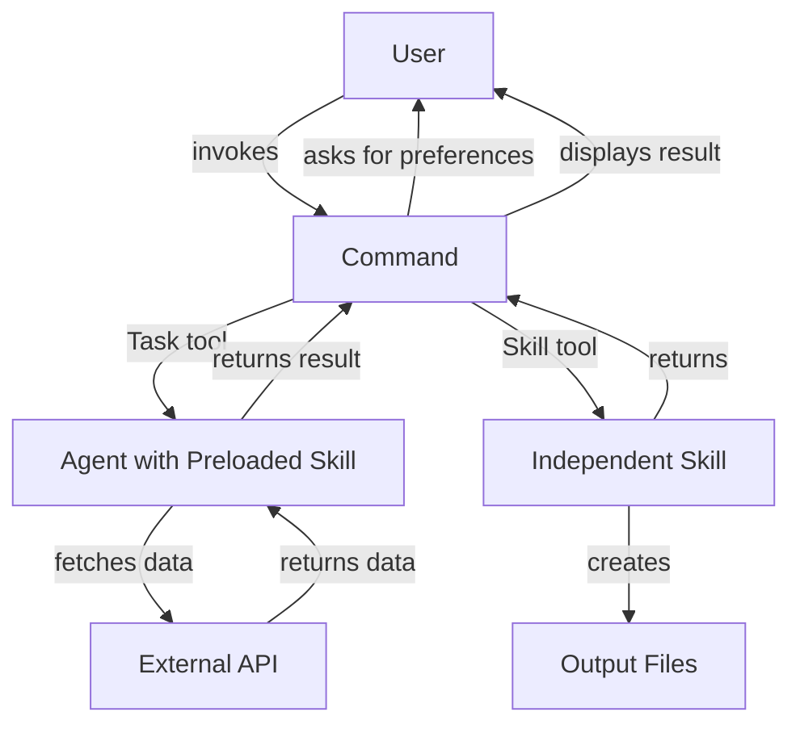

## Overview

The **Orchestration Workflow** is a design pattern that coordinates multiple Claude Code components to handle complex, multi-step tasks. It demonstrates how Commands, Agents, and Skills work together in a hierarchical workflow.

**Pattern**: Command → Agent (with skill) → Skill

<Note>
This pattern is ideal for workflows that require user interaction, data fetching, and output generation as separate concerns.
</Note>

## Architecture

The orchestration workflow separates concerns across three component types:

<CardGroup cols={3}>
  <Card title="Command" icon="terminal">
    **Entry point** that handles user interaction and orchestrates the workflow
  </Card>
  <Card title="Agent" icon="robot">
    **Data fetcher** that uses preloaded skills as domain knowledge
  </Card>
  <Card title="Skill" icon="wand-magic-sparkles">
    **Output creator** that generates visual or formatted results
  </Card>
</CardGroup>

### Flow Diagram



## When to Use

Use the orchestration workflow when you need:

<AccordionGroup>
  <Accordion title="Multi-Step Processes">
    Breaking complex tasks into discrete phases (gather input → fetch data → generate output)
  </Accordion>
  
  <Accordion title="User Interaction">
    Asking users for preferences or decisions before proceeding
  </Accordion>
  
  <Accordion title="Specialized Agents">
    Leveraging agents with domain-specific knowledge (preloaded skills)
  </Accordion>
  
  <Accordion title="Reusable Components">
    Creating modular, reusable components that can be mixed and matched
  </Accordion>
</AccordionGroup>

## Real Example: Weather System

The weather system demonstrates orchestration with a command that coordinates an agent and skill to fetch and display weather data.

### Component Details

<Steps>
  <Step title="Command: weather-orchestrator">
    **Location**: `.claude/commands/weather-orchestrator.md`
    
    **Purpose**: Entry point that orchestrates the workflow
    
    **Responsibilities**:
    - Ask user for temperature unit (Celsius/Fahrenheit)
    - Invoke weather-agent via Task tool
    - Invoke weather-svg-creator via Skill tool
    - Display results to user
    
    **Model**: haiku (fast, cheap for orchestration)
  </Step>
  
  <Step title="Agent: weather-agent">
    **Location**: `.claude/agents/weather-agent.md`
    
    **Purpose**: Fetch weather data using preloaded skill
    
    **Preloaded Skill**: `weather-fetcher` (agent skill pattern)
    
    **Process**:
    1. Follows weather-fetcher skill instructions
    2. Fetches temperature from Open-Meteo API
    3. Returns temperature value and unit to command
    
    **Model**: sonnet (balanced for API integration)
    
    ```yaml
    ---
    name: weather-agent
    skills:
      - weather-fetcher  # Preloaded into agent context
    tools: WebFetch, Read, Write, Edit
    model: sonnet
    memory: project
    ---
    ```
  </Step>
  
  <Step title="Skill: weather-fetcher (Preloaded)">
    **Location**: `.claude/skills/weather-fetcher/SKILL.md`
    
    **Purpose**: Instructions for fetching temperature data
    
    **Pattern**: Agent Skill (preloaded, not invoked directly)
    
    **Data Source**: Open-Meteo API for Dubai, UAE
    
    ```yaml
    ---
    name: weather-fetcher
    description: Instructions for fetching weather data
    user-invocable: false  # Background knowledge only
    ---
    ```
    
    The skill provides step-by-step instructions:
    1. Choose API URL based on unit (Celsius/Fahrenheit)
    2. Fetch data via WebFetch tool
    3. Extract temperature from JSON response
    4. Return value and unit
  </Step>
  
  <Step title="Skill: weather-svg-creator (Independent)">
    **Location**: `.claude/skills/weather-svg-creator/SKILL.md`
    
    **Purpose**: Create visual SVG weather card
    
    **Pattern**: Skill (invoked via Skill tool)
    
    **Outputs**:
    - `orchestration-workflow/weather.svg` - SVG weather card
    - `orchestration-workflow/output.md` - Weather summary
    
    The skill receives temperature data from the command's context and generates styled output files.
  </Step>
</Steps>

### Execution Flow

<CodeGroup>
```bash Example Usage
/weather-orchestrator
```

```text Step-by-Step Execution
1. User invokes: /weather-orchestrator
   ↓
2. Command asks: "Celsius or Fahrenheit?"
   User responds: "Celsius"
   ↓
3. Command invokes weather-agent via Task tool
   ↓
4. Agent follows weather-fetcher skill instructions:
   - Fetches from Open-Meteo API
   - Extracts temperature: 26°C
   - Returns to command: temperature=26, unit=Celsius
   ↓
5. Command invokes weather-svg-creator via Skill tool
   ↓
6. Skill creates:
   - orchestration-workflow/weather.svg
   - orchestration-workflow/output.md
   ↓
7. Command displays:
   - Unit: Celsius
   - Temperature: 26°C
   - Files created
```
</CodeGroup>

### Code Snippets

<Tabs>
  <Tab title="Command">
    ```markdown .claude/commands/weather-orchestrator.md
    ---
    description: Fetch weather and create SVG card
    model: haiku
    ---

    # Weather Orchestrator Command

    ## Workflow

    ### Step 1: Ask User Preference
    Use AskUserQuestion to ask for Celsius or Fahrenheit.

    ### Step 2: Fetch Weather Data
    Use Task tool to invoke weather-agent:
    - subagent_type: weather-agent
    - prompt: Fetch temperature in [user's unit]

    ### Step 3: Create SVG Weather Card
    Use Skill tool to invoke weather-svg-creator:
    - skill: weather-svg-creator
    ```
  </Tab>
  
  <Tab title="Agent">
    ```markdown .claude/agents/weather-agent.md
    ---
    name: weather-agent
    description: Fetch weather data for Dubai
    tools: WebFetch, Read, Write, Edit
    model: sonnet
    memory: project
    skills:
      - weather-fetcher
    ---

    # Weather Agent

    You are a specialized weather agent.

    ## Your Task
    1. Follow weather-fetcher skill instructions
    2. Fetch current temperature
    3. Return temperature value and unit to caller
    ```
  </Tab>
  
  <Tab title="Skill (Preloaded)">
    ```markdown .claude/skills/weather-fetcher/SKILL.md
    ---
    name: weather-fetcher
    description: Fetch weather temperature data
    user-invocable: false
    ---

    # Weather Fetcher Skill

    ## Instructions

    1. **Fetch Weather Data**: Use WebFetch with API URL
       - Celsius: https://api.open-meteo.com/v1/forecast?...
       - Fahrenheit: https://api.open-meteo.com/v1/forecast?...

    2. **Extract Temperature**: From JSON response
       - Field: `current.temperature_2m`

    3. **Return Result**: Temperature value and unit
    ```
  </Tab>
  
  <Tab title="Skill (Independent)">
    ```markdown .claude/skills/weather-svg-creator/SKILL.md
    ---
    name: weather-svg-creator
    description: Creates SVG weather card
    ---

    # Weather SVG Creator Skill

    ## Task
    Create SVG weather card and write output files.

    ## Instructions

    1. Create SVG with temperature from context
    2. Write to orchestration-workflow/weather.svg
    3. Write summary to orchestration-workflow/output.md
    ```
  </Tab>
</Tabs>

## Key Design Principles

<CardGroup cols={2}>
  <Card title="Two Skill Patterns" icon="layer-group">
    - **Agent Skills**: Preloaded via `skills:` field (domain knowledge)
    - **Skills**: Invoked via Skill tool (independent execution)
  </Card>
  
  <Card title="Command as Orchestrator" icon="diagram-project">
    Command handles user interaction and coordinates workflow - doesn't implement business logic
  </Card>
  
  <Card title="Agent for Data" icon="database">
    Agent uses preloaded skill to fetch data, then returns it to command
  </Card>
  
  <Card title="Skill for Output" icon="file-export">
    Independent skill receives data from context and creates visual/formatted outputs
  </Card>
</CardGroup>

### Clean Separation of Concerns

| Component | Responsibility | Data Flow |
|-----------|---------------|----------|
| **Command** | User interaction, orchestration | Receives user input → coordinates agents/skills → displays results |
| **Agent** | Domain knowledge, data fetching | Receives request → executes skill instructions → returns data |
| **Skill** | Output generation | Receives data from context → creates files → reports completion |

## Implementation Guide

<Steps>
  <Step title="Design Your Workflow">
    Identify the stages:
    1. What user input is needed?
    2. What data needs to be fetched?
    3. What output needs to be generated?
  </Step>
  
  <Step title="Create Command">
    Create `.claude/commands/your-command.md`:
    - Handle user interaction with AskUserQuestion
    - Orchestrate agents with Task tool
    - Invoke skills with Skill tool
    - Use fast model (haiku) for orchestration
  </Step>
  
  <Step title="Create Agent with Preloaded Skill">
    Create `.claude/agents/your-agent.md`:
    - Define agent with `skills:` field
    - List required tools
    - Choose appropriate model for task
    
    Create `.claude/skills/your-skill/SKILL.md`:
    - Set `user-invocable: false` (background knowledge)
    - Provide detailed instructions for agent
  </Step>
  
  <Step title="Create Output Skill">
    Create `.claude/skills/output-creator/SKILL.md`:
    - Define what data it expects from context
    - Specify output files to create
    - Keep focused on single output responsibility
  </Step>
  
  <Step title="Test the Workflow">
    ```bash
    /your-command
    ```
    
    Verify:
    - User prompts work correctly
    - Agent fetches data successfully
    - Skill generates expected output
    - Error handling works gracefully
  </Step>
</Steps>

<Tip>
Use `haiku` for commands (fast orchestration), `sonnet` for agents (balanced reasoning), and let skills inherit the command's context.
</Tip>

## Advanced Patterns

### Multiple Agents

Orchestrate multiple specialized agents:

```markdown
## Step 2: Gather Data from Multiple Sources

1. Use Task tool to invoke weather-agent (temperature)
2. Use Task tool to invoke location-agent (coordinates)
3. Use Task tool to invoke timezone-agent (local time)

## Step 3: Combine Results

Use Skill tool to invoke data-combiner skill with all results.
```

### Conditional Workflows

Branch based on user input or data:

```markdown
## Step 1: Ask User for Report Type

Use AskUserQuestion: "Summary or Detailed?"

## Step 2: Conditional Execution

If "Summary":
  - Invoke summary-agent
  - Invoke summary-formatter skill

If "Detailed":
  - Invoke detailed-agent
  - Invoke detailed-formatter skill
```

### Error Handling

Handle failures gracefully:

```markdown
## Error Handling

1. If agent fails to fetch data:
   - Retry once
   - If still failing, use cached data (if available)
   - Inform user of degraded results

2. If skill fails to create output:
   - Fall back to text-only output
   - Log error for debugging
```

## Best Practices

<Check>**Do** use commands for orchestration - they're lightweight and user-facing</Check>
<Check>**Do** preload skills into agents when they need domain-specific knowledge</Check>
<Check>**Do** keep skills focused on single responsibilities</Check>
<Check>**Do** use appropriate models: haiku for commands, sonnet for agents</Check>
<Check>**Don't** put business logic in commands - delegate to agents/skills</Check>
<Check>**Don't** invoke agents directly via bash - always use Task tool</Check>
<Check>**Don't** create circular dependencies between components</Check>

## Troubleshooting

<AccordionGroup>
  <Accordion title="Agent not using preloaded skill">
    **Problem**: Agent doesn't follow skill instructions
    
    **Solution**: 
    - Verify skill is listed in agent's `skills:` field
    - Check skill file is at `.claude/skills/skill-name/SKILL.md`
    - Ensure agent prompt references the skill
  </Accordion>
  
  <Accordion title="Skill not found when invoked">
    **Problem**: Skill tool can't find the skill
    
    **Solution**:
    - Check skill directory structure: `.claude/skills/skill-name/SKILL.md`
    - Verify `name:` in frontmatter matches invocation
    - Ensure SKILL.md file exists (case-sensitive)
  </Accordion>
  
  <Accordion title="Data not passing between components">
    **Problem**: Skill doesn't receive data from agent
    
    **Solution**:
    - Agent must return data to command explicitly
    - Command must invoke skill AFTER receiving agent response
    - Skill receives data from current conversation context
  </Accordion>
</AccordionGroup>

## Related Patterns

<CardGroup cols={2}>
  <Card title="RPI Workflow" icon="diagram-project" href="/workflows/rpi-workflow">
    Research → Plan → Implement pattern for feature development
  </Card>
  <Card title="Agent Teams" icon="users" href="/workflows/agent-teams">
    Multiple agents working in parallel on shared tasks
  </Card>
  <Card title="Git Worktrees" icon="code-branch" href="/workflows/git-worktrees">
    Isolated development environments for parallel work
  </Card>
</CardGroup>

## Resources

<CardGroup cols={2}>
  <Card title="Commands Guide" icon="book" href="/essentials/commands">
    Learn more about creating commands
  </Card>
  <Card title="Agents Guide" icon="robot" href="/essentials/agents">
    Deep dive into agent configuration
  </Card>
  <Card title="Skills Guide" icon="wand-magic-sparkles" href="/essentials/skills">
    Master skills and progressive disclosure
  </Card>
  <Card title="Example Code" icon="github" href="https://github.com/shanraisshan/claude-code-best-practice/tree/main/orchestration-workflow">
    Full working example on GitHub
  </Card>
</CardGroup>