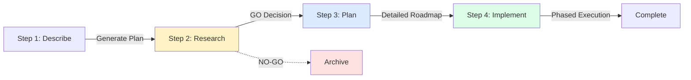

## Overview

**RPI** = **R**esearch → **P**lan → **I**mplement

A systematic development workflow with validation gates at each phase. RPI prevents wasted effort on non-viable features by validating product-market fit and technical feasibility before committing to implementation.

<Note>
This workflow is ideal for new features that require strategic alignment, technical discovery, and phased execution.
</Note>

## Why RPI?

Traditional development often jumps straight to implementation, discovering issues late:

<CardGroup cols={2}>
  <Card title="❌ Traditional Approach" icon="triangle-exclamation" color="#ef4444">
    - Start coding immediately
    - Discover technical blockers mid-implementation
    - Realize feature doesn't align with product vision
    - Waste significant development time
    - No clear go/no-go decision point
  </Card>
  
  <Card title="✅ RPI Workflow" icon="circle-check" color="#22c55e">
    - Validate viability first (Research)
    - Plan architecture and phases (Plan)
    - Execute with validation gates (Implement)
    - Clear go/no-go decision at each stage
    - Constitutional alignment throughout
  </Card>
</CardGroup>

## Workflow Stages



<Steps>
  <Step title="Describe" icon="pencil">
    **Goal**: Create initial feature description
    
    **Process**: Use plan mode to generate feature description in `rpi/{feature-slug}/REQUEST.md`
    
    **Output**: `REQUEST.md` with feature requirements and goals
  </Step>
  
  <Step title="Research" icon="magnifying-glass">
    **Goal**: GO/NO-GO decision gate
    
    **Command**: `/rpi:research rpi/{feature-slug}/REQUEST.md`
    
    **Agents Used**:
    - requirement-parser
    - product-manager
    - Explore (code discovery)
    - senior-software-engineer
    - technical-cto-advisor
    - documentation-analyst-writer
    
    **Output**: `research/RESEARCH.md` with viability assessment and recommendation
  </Step>
  
  <Step title="Plan" icon="sitemap">
    **Goal**: Create comprehensive planning documentation
    
    **Command**: `/rpi:plan {feature-slug}`
    
    **Agents Used**:
    - senior-software-engineer (architecture)
    - product-manager (requirements)
    - ux-designer (user experience)
    - documentation-analyst-writer (synthesis)
    
    **Outputs**:
    - `plan/pm.md` - Product requirements
    - `plan/ux.md` - UX design
    - `plan/eng.md` - Technical specification
    - `plan/PLAN.md` - Phased implementation roadmap
  </Step>
  
  <Step title="Implement" icon="code">
    **Goal**: Execute phased implementation with validation gates
    
    **Command**: `/rpi:implement {feature-slug}`
    
    **Agents Used**:
    - Explore (pre-implementation discovery)
    - senior-software-engineer (implementation)
    - code-reviewer (quality gates)
    - constitutional-validator (compliance)
    
    **Output**: `implement/IMPLEMENT.md` with phase validation records
  </Step>
</Steps>

## Example: OAuth2 Authentication

Let's walk through implementing OAuth2 authentication using RPI.

### Step 1: Describe

<CodeGroup>
```bash User Request
User: "Add OAuth2 authentication with Google and GitHub providers"
```

```markdown Generated Plan
# rpi/plans/oauth2-authentication.md

## Feature: OAuth2 Authentication

### Goals
- Support Google and GitHub OAuth2 providers
- Secure token management
- User profile sync

### Requirements
- OAuth2 flow implementation
- Provider configuration
- Token storage and refresh
- User session management
```
</CodeGroup>

**Action**: Copy plan to `rpi/oauth2-authentication/REQUEST.md`

### Step 2: Research

<CodeGroup>
```bash Command
/rpi:research rpi/oauth2-authentication/REQUEST.md
```

```markdown Output: research/RESEARCH.md
# Research Report: OAuth2 Authentication

## Executive Summary
GO - Feature is viable and aligns with product strategy.

## Product Analysis
- **User Value**: High - requested by 45% of users
- **Market Fit**: Strong - industry standard auth
- **Strategic Alignment**: Yes - roadmap item Q1

## Technical Discovery
- **Current State**: Basic email/password auth exists
- **Integration Points**: User model, auth middleware
- **Dependencies**: Passport.js already installed

## Technical Feasibility
- **Complexity**: Medium
- **Approach**: Leverage Passport.js OAuth strategies
- **Risks**: Token refresh handling, provider changes

## Recommendation
**GO** - Proceed to planning phase

Confidence: High
```
</CodeGroup>

<Check>Research verdict: **GO** - proceed to planning</Check>

### Step 3: Plan

<CodeGroup>
```bash Command
/rpi:plan oauth2-authentication
```

```markdown Outputs Generated
rpi/oauth2-authentication/plan/
├── pm.md       # 3 user stories, acceptance criteria
├── ux.md       # Login flows, error states
├── eng.md      # Architecture, API specs, DB schema
└── PLAN.md     # 3 phases, 15 tasks
```
</CodeGroup>

<Tabs>
  <Tab title="PLAN.md Overview">
    ```markdown
    # Implementation Plan

    ## Phase 1: Backend Foundation (5 tasks)
    - [ ] Add OAuth provider configs
    - [ ] Implement Passport strategies
    - [ ] Create token storage
    - [ ] Add refresh token logic
    - [ ] Write unit tests

    ## Phase 2: Frontend Integration (6 tasks)
    - [ ] Create OAuth login buttons
    - [ ] Implement OAuth callback handlers
    - [ ] Add provider selection UI
    - [ ] Handle OAuth errors
    - [ ] Add loading states
    - [ ] Write integration tests

    ## Phase 3: Testing & Polish (4 tasks)
    - [ ] End-to-end OAuth flows
    - [ ] Security audit
    - [ ] Documentation
    - [ ] Staging deployment
    ```
  </Tab>
  
  <Tab title="eng.md Excerpt">
    Technical specification includes:
    
    **OAuth Flow:**
    1. User clicks "Login with Google"
    2. Redirect to Google OAuth consent
    3. Google redirects to callback with code
    4. Exchange code for access/refresh tokens
    5. Fetch user profile
    6. Create or update user record
    7. Create session
    
    **Database Schema:** oauth_providers table with user_id, provider, tokens, and expiration fields
  </Tab>
</Tabs>

### Step 4: Implement

<CodeGroup>
```bash Command
/rpi:implement oauth2-authentication
```

```markdown Phase Execution
## Phase 1: Backend Foundation

1. Code Discovery (Explore agent)
   └─→ Analyzed auth middleware, user model patterns

2. Implementation (senior-software-engineer)
   └─→ Added OAuth configs, Passport strategies, token storage

3. Self-Validation
   └─→ Linting: PASS | Tests: PASS | Build: SUCCESS

4. Code Review (code-reviewer agent)
   └─→ Verdict: APPROVED WITH SUGGESTIONS
       - Add rate limiting to OAuth callbacks
       - Use constant-time comparison for tokens

5. User Validation Gate
   ⏸️  WAITING FOR USER APPROVAL
   
   Deliverables:
   - [x] OAuth provider configs added
   - [x] Passport strategies implemented
   - [x] Token storage created
   - [x] Refresh token logic added
   - [x] Unit tests written (coverage: 94%)
   
   Files changed:
   - config/oauth.js (+127)
   - auth/strategies/ (+245)
   - models/oauthProvider.js (+89)
   
   **Validate Phase 1: PASS / CONDITIONAL PASS / FAIL?**
```
</CodeGroup>

<Info>
Each phase includes a **User Validation Gate** - you must explicitly approve before proceeding to the next phase.
</Info>

### Complete Feature

After all phases pass validation:

```markdown
## Implementation Complete

### Summary
- Feature: oauth2-authentication
- Phases: 3 of 3 completed
- Files Modified: 18 files (+1,247 -89 lines)
- Tests Added: 47 unit, 12 integration, 6 e2e
- All phases: PASS ✓

### Next Steps
1. Create PR: [oauth2-authentication] Add Google and GitHub OAuth
2. Deploy to staging
3. QA validation
4. Production deployment
```

## Feature Folder Structure

All RPI work is organized in `rpi/{feature-slug}/`:

```
rpi/oauth2-authentication/
├── REQUEST.md              # Step 1: Initial description
├── research/
│   └── RESEARCH.md         # Step 2: GO/NO-GO analysis
├── plan/
│   ├── PLAN.md             # Step 3: Implementation roadmap
│   ├── pm.md               # Product requirements
│   ├── ux.md               # UX design
│   └── eng.md              # Technical spec
└── implement/
    └── IMPLEMENT.md        # Step 4: Phase validation records
```

<Tip>
This structure creates a complete audit trail from initial idea to shipped feature.
</Tip>

## Commands Reference

<AccordionGroup>
  <Accordion title="/rpi:research <feature-slug>">
    **Purpose**: Research and validate feature viability
    
    **Input**: `rpi/{feature-slug}/REQUEST.md`
    
    **Phases**:
    1. Parse requirements (requirement-parser)
    2. Product analysis (product-manager)
    3. Code discovery (Explore)
    4. Technical feasibility (senior-software-engineer)
    5. Strategic assessment (technical-cto-advisor)
    6. Generate report (documentation-analyst-writer)
    
    **Output**: `research/RESEARCH.md` with GO/NO-GO recommendation
    
    **Verdicts**:
    - **GO**: Proceed to planning
    - **CONDITIONAL GO**: Address conditions first
    - **DEFER**: Revisit later
    - **NO-GO**: Archive or explore alternatives
  </Accordion>
  
  <Accordion title="/rpi:plan <feature-slug>">
    **Purpose**: Create comprehensive planning documentation
    
    **Prerequisites**: Research completed with GO recommendation
    
    **Phases**:
    1. Load research findings
    2. Analyze requirements and architecture
    3. Design architecture (senior-software-engineer)
    4. Break down into phases and tasks
    5. Generate documentation
    
    **Outputs**:
    - `plan/pm.md` - Product requirements and user stories
    - `plan/ux.md` - User experience design
    - `plan/eng.md` - Technical specification
    - `plan/PLAN.md` - Phased implementation roadmap
  </Accordion>
  
  <Accordion title="/rpi:implement <feature-slug> [--phase N]">
    **Purpose**: Execute phased implementation with validation gates
    
    **Prerequisites**: Planning completed
    
    **Per-Phase Flow**:
    1. Code discovery (Explore agent)
    2. Implementation (senior-software-engineer)
    3. Self-validation (linting, tests, build)
    4. Code review (code-reviewer agent)
    5. **User validation gate** ⏸️ STOP for approval
    6. Documentation update
    
    **Flags**:
    - `--phase N`: Execute specific phase
    - `--validate-only`: Validate without implementing
    
    **Output**: `implement/IMPLEMENT.md` with validation records
  </Accordion>
</AccordionGroup>

## Agents Used

RPI orchestrates specialized agents at each stage:

### Research Agents

| Agent | Role | Model |
|-------|------|-------|
| requirement-parser | Extract structured requirements | sonnet |
| product-manager | Assess product viability | sonnet |
| Explore | Discover existing code | inherit |
| senior-software-engineer | Technical feasibility | opus |
| technical-cto-advisor | Strategic recommendation | opus |
| documentation-analyst-writer | Generate report | inherit |

### Planning Agents

| Agent | Role | Model |
|-------|------|-------|
| senior-software-engineer | Architecture design | opus |
| product-manager | Product requirements | sonnet |
| ux-designer | User experience design | sonnet |
| documentation-analyst-writer | Documentation synthesis | inherit |

### Implementation Agents

| Agent | Role | Model |
|-------|------|-------|
| Explore | Pre-implementation discovery | inherit |
| senior-software-engineer | All implementation tasks | opus |
| code-reviewer | Quality validation | opus |
| constitutional-validator | Compliance checking | sonnet |

<Note>
All agents use **opus** for implementation to maximize quality. Research and planning use **sonnet** for balanced performance.
</Note>

## Constitutional Alignment

RPI enforces project principles throughout the workflow:

<Steps>
  <Step title="Research Phase">
    **Constitutional Validation**:
    - Does feature align with product vision?
    - Does it violate any project constraints?
    - Is it consistent with technical principles?
    
    If constitution exists, product-manager agent checks alignment.
  </Step>
  
  <Step title="Planning Phase">
    **Constitutional Constraints**:
    - Architecture must respect boundaries
    - Testing requirements from constitution
    - Code quality standards
    
    Plans incorporate constitutional requirements.
  </Step>
  
  <Step title="Implementation Phase">
    **Constitutional Enforcement**:
    - Type safety maintained
    - Component isolation respected
    - No breaking changes
    - Tests required
    
    constitutional-validator agent checks compliance.
  </Step>
</Steps>

**Constitution File Locations**:
- `constitution.md`
- `PRINCIPLES.md`
- `.project/constitution.md`

## Validation Gates

RPI includes multiple validation checkpoints:

<CardGroup cols={2}>
  <Card title="Research Gate" icon="shield-check">
    **GO/NO-GO Decision**
    
    Prevents wasted effort on:
    - Non-viable features
    - Misaligned initiatives
    - Technically infeasible ideas
  </Card>
  
  <Card title="Planning Gate" icon="clipboard-check">
    **Architecture Review**
    
    Validates:
    - Technical approach
    - Phased breakdown
    - Resource requirements
  </Card>
  
  <Card title="Phase Gates" icon="user-check">
    **User Validation**
    
    Each phase requires approval:
    - Deliverables completed?
    - Tests passing?
    - Code review passed?
  </Card>
  
  <Card title="Quality Gates" icon="check-double">
    **Automated Checks**
    
    Every phase must pass:
    - Linting
    - Tests
    - Build
    - Code review
  </Card>
</CardGroup>

## When to Use RPI

<Tabs>
  <Tab title="✅ Use RPI For">
    - **New features** requiring strategic alignment
    - **Complex features** spanning multiple components
    - **Features with uncertainty** (technical or product)
    - **Multi-phase implementations**
    - **Team projects** requiring coordination
    - **Features needing validation gates**
  </Tab>
  
  <Tab title="❌ Don't Use RPI For">
    - **Bug fixes** (too heavyweight)
    - **Simple changes** (less than 30 minutes work)
    - **Documentation-only** updates
    - **Exploratory prototyping**
    - **Urgent hotfixes**
    - **Trivial refactoring**
  </Tab>
</Tabs>

## Best Practices

<Check>**Do** complete research before planning - don't skip the GO/NO-GO gate</Check>
<Check>**Do** run `/compact` after each stage to preserve context</Check>
<Check>**Do** review RESEARCH.md and PLAN.md before implementing</Check>
<Check>**Do** wait for user validation at each phase gate</Check>
<Check>**Do** leverage code discovery from Explore agent</Check>
<Check>**Don't** skip validation gates - they catch issues early</Check>
<Check>**Don't** proceed with NO-GO recommendations without addressing concerns</Check>
<Check>**Don't** implement multiple phases without user approval</Check>

## Installation

Copy the RPI workflow to your project:

<Steps>
  <Step title="Copy Agent and Command Files">
    ```bash
    # Copy from claude-code-best-practice repo
    cp -r development-workflows/rpi/.claude/agents/* .claude/agents/
    cp -r development-workflows/rpi/.claude/commands/rpi .claude/commands/
    ```
  </Step>
  
  <Step title="Create RPI Directory">
    ```bash
    mkdir -p rpi/plans
    ```
  </Step>
  
  <Step title="Optional: Add Constitution">
    ```bash
    # Create project principles
    touch constitution.md
    ```
    
    Define your project's technical and product principles.
  </Step>
  
  <Step title="Verify Installation">
    ```bash
    /rpi:research --help
    /rpi:plan --help
    /rpi:implement --help
    ```
  </Step>
</Steps>

## Troubleshooting

<AccordionGroup>
  <Accordion title="Research takes too long">
    **Problem**: Research phase consuming significant context
    
    **Solutions**:
    - Run `/compact` before starting research
    - Provide focused REQUEST.md (avoid too much detail)
    - Run research in isolated session if needed
    - Use `--phase` flag to focus on specific analysis
  </Accordion>
  
  <Accordion title="Agent fails during phase">
    **Problem**: Agent times out or errors
    
    **Solutions**:
    - Retry the specific phase: `/rpi:implement feature --phase N`
    - Check agent configuration in `.claude/agents/`
    - Verify required tools are available to agent
    - Reduce phase scope in PLAN.md if too large
  </Accordion>
  
  <Accordion title="Validation gate unclear">
    **Problem**: Don't know if phase should pass
    
    **Solutions**:
    - Review validation criteria in PLAN.md
    - Check code review verdict
    - Run tests manually to verify
    - Use CONDITIONAL PASS and document concerns
  </Accordion>
</AccordionGroup>

## Advanced Usage

### Resume Partial Implementation

```bash
# Resume from specific phase
/rpi:implement oauth2-authentication --phase 2
```

### Validate Without Implementing

```bash
# Check if phase would pass
/rpi:implement oauth2-authentication --phase 3 --validate-only
```

### Custom Phase Breakdown

Edit `plan/PLAN.md` before implementing:

```markdown
## Phase 1: Database Layer (2 tasks)
- [ ] Add OAuth schema
- [ ] Create migrations

## Phase 2: Authentication Logic (4 tasks)
- [ ] Implement Passport strategies
- [ ] Add token management
- [ ] Create session handlers
- [ ] Write unit tests

## Phase 3: API Endpoints (3 tasks)
...
```

## Related Patterns

<CardGroup cols={2}>
  <Card title="Orchestration Workflow" icon="diagram-project" href="/workflows/orchestration-workflow">
    Command → Agent → Skill pattern for complex workflows
  </Card>
  <Card title="Agent Teams" icon="users" href="/workflows/agent-teams">
    Multiple agents working in parallel
  </Card>
  <Card title="Git Worktrees" icon="code-branch" href="/workflows/git-worktrees">
    Isolated branches for parallel development
  </Card>
</CardGroup>

## Resources

<CardGroup cols={2}>
  <Card title="RPI Example" icon="github" href="https://github.com/shanraisshan/claude-code-best-practice/tree/main/development-workflows/rpi">
    Full RPI workflow implementation
  </Card>
  <Card title="Agents Guide" icon="robot" href="/essentials/agents">
    Learn about agent configuration
  </Card>
  <Card title="Commands Guide" icon="terminal" href="/essentials/commands">
    Master command creation
  </Card>
  <Card title="Constitutional AI" icon="book-open" href="https://www.anthropic.com/news/claudes-constitution">
    Learn about constitutional alignment
  </Card>
</CardGroup>